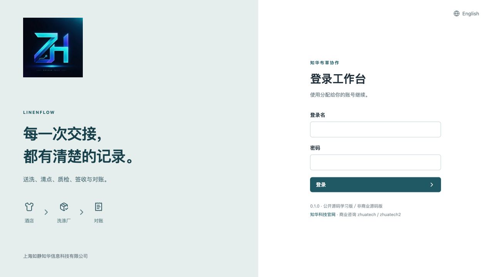
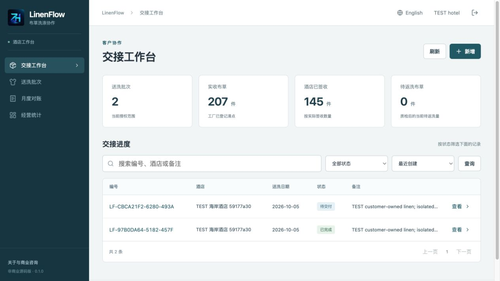
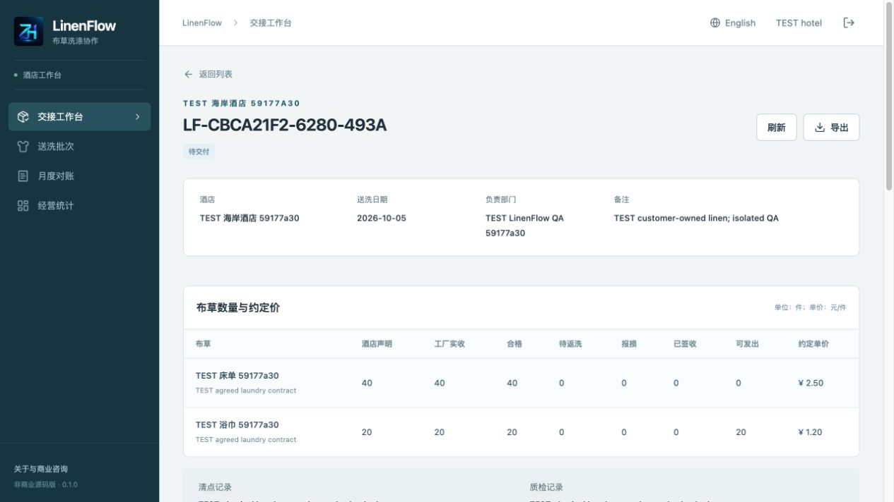
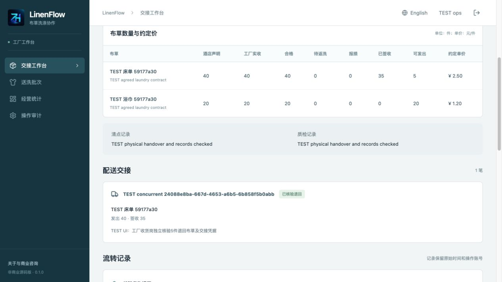
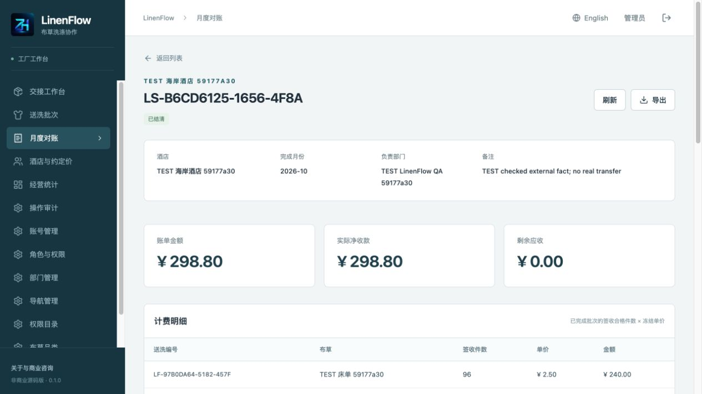
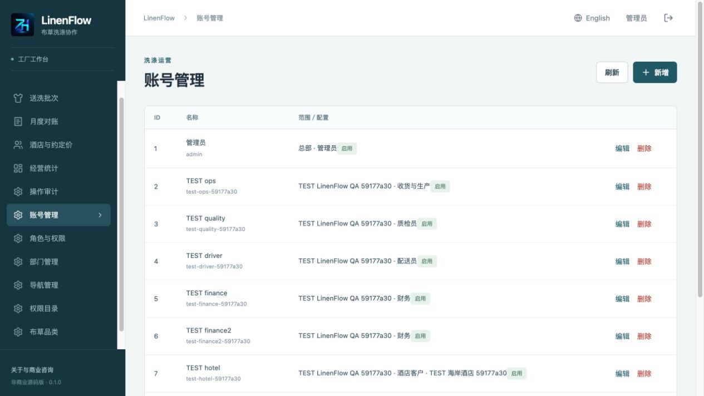
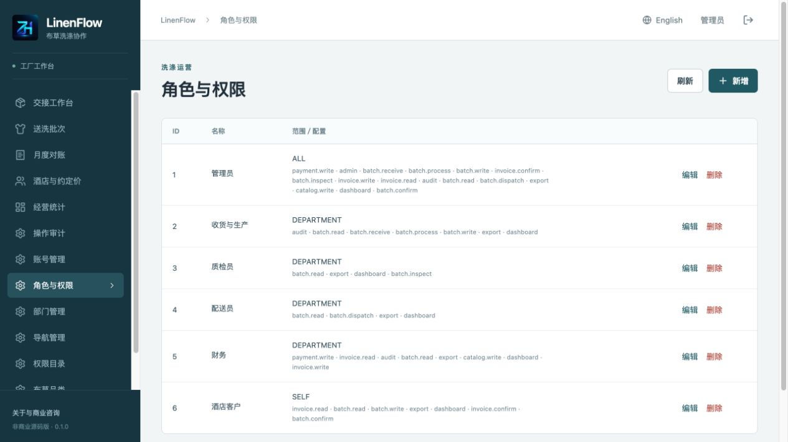
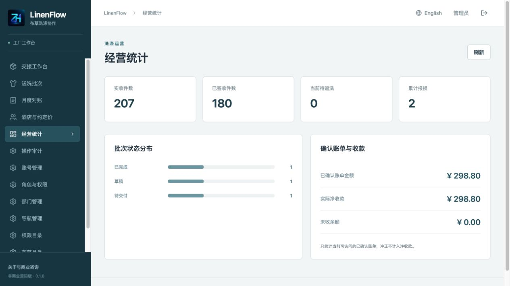
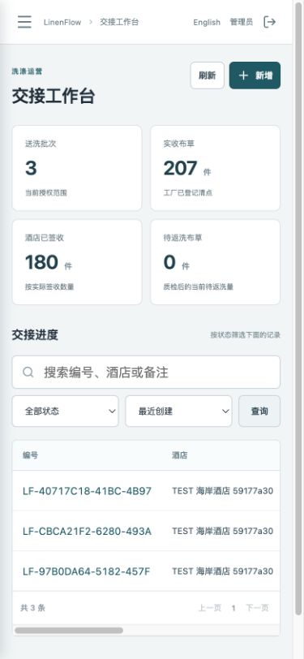

[中文](README.md) | [English](README.en.md)


# ZhiHua LinenFlow · Hotel Laundry Handover and Monthly Reconciliation

**ZhiHua Technology (Shanghai Rujing Zhihua Information Technology Co., Ltd.)** · [Official website](https://www.zhuatech.cn/).

Version 0.1.0 connects customer-owned hotel linen declarations, actual factory counts, independent quality checks, partial deliveries, hotel acceptance and monthly reconciliation. Java 21 / Spring Boot / Vue 3 / MySQL support Chinese/English desktop and mobile views using the same backend. Intended for industrial laundry, hotel operations and software teams learning/evaluating an isolated deployment.

**Source available for individual learning, technical research and non-commercial exchange.** Commercial use, enterprise deployment, paid implementation/client delivery, SaaS, commercial development and resale require prior written company authorization. The existing [LICENSE](LICENSE) governs own source; this is not an OSI-approved open-source license. Third-party components retain their terms. The system is provided as-is.

## Actual business workflow

```text
Hotel draft → Submit/freeze agreed prices → Factory count → Hotel confirms count
                                                             ↓
Wash → Independent inspection → Rewash/reinspection → Partial deliveries
                                                             ↓
Hotel counts/signs → Independent factory verification of refused physical returns
                                                             ↓
All accepted good pieces / loss results checked → Hotel confirms batch completion
                                                             ↓
Completed-month unbilled batches → Issue statement → Hotel confirms/disputes
                                                             ↓
Record verified external receipts → Paid; independent full reversal preserves original entry
```

A declaration is not physical factory receipt. Even an equal count requires the bound hotel account's confirmation before washing; administrators cannot act as the hotel to accept delivery or confirm statements.

Every inspection must satisfy **good + rewash + discarded = actual factory receipt**. Previously good/discarded quantities cannot decrease in later rounds. Inspector differs from the current wash operator. Rewashing does not increase receipts or bill the same pieces again.

Refused pieces continue to reserve delivery quantity until an independent factory actor verifies all rejected physical pieces returned. Return verifier differs from dispatcher; partial physical return release is not implemented. Submitted handover/count notes record operator facts, without automated physical verification or electronic signature.

Billing is accepted good pieces of hotel-confirmed completed batches × prices frozen on submission. Fixed CNY per-piece pricing; rewash/discarded pieces incur no washing charge. Statements group by completion month in Asia/Shanghai; a batch belongs to at most one effective invoice. Disputed statements can be cancelled/regrouped while old statement/link history remains.

## Roles, implemented features and data scopes

| Role | Implemented operations |
| --- | --- |
| Hotel customer | Own-hotel draft CRUD, submit/cancel, count confirmation/recount, partial acceptance, completion, statement confirmation/dispute, statistics and exports |
| Receiving/production | Department drafts, physical counts, washing/rewashing and independent rejected-return verification |
| Quality | Department item good/rewash/discard counts, conservation and separate actor enforcement |
| Delivery | Department partial dispatch with accepted/unresolved reservations deducted; over-dispatch protection |
| Finance | Customer/agreed prices, completed-month grouping, issue/cancel, partial external-receipt records, independent full reversal and balances |
| Administrator | Departments, accounts/hotel binding, roles/API permissions, menus, registered permission descriptions, dictionaries/settings, master data and audit; last-admin/reference protection |

Business views include search/status filtering, paging and bounded sorting, price/count/evidence detail, deliveries, payments/events and scoped JSON snapshot export. Administration configures registered permission descriptions and existing navigation labels/order/requirements, without inventing an unimplemented API.

Factory roles follow department scope. Hotel binding overrides ALL/DEPARTMENT/SELF scopes and cannot expose other hotels or factory administration/audit, even if admin permissions are assigned. Factory SELF reads authored/currently operated batches and authored statements. Menu visibility does not replace server authorization.

## Actual running screenshots

Existing screens show actual operations in an independent test instance. TEST records are synthetic acceptance data, not actual hotels, customer cases or transactions.

| Account login | Hotel handover workbench |
| --- | --- |
|  |  |
| Factory counts and inspection conservation | Partial delivery and hotel acceptance |
|  |  |

Monthly statement quantities/prices/payments:



| Accounts and hotel binding | Roles and data scopes |
| --- | --- |
|  |  |
| Scoped operating totals | Mobile handover workbench |
|  |  |

## Environment and architecture

Java **21**, Maven **3.9**, Spring Boot **4.0.7**, Spring Security/JPA/Flyway; MariaDB JDBC **3.5.10** connects MySQL **8.4**. Frontend: Node.js **24.19+**, npm **11**, Vue **3.5.40**, Vite **8.1.5**, Lucide **1.48.0**. Checks use Spotless/JUnit/H2, ESLint/Prettier and Node tests. Docker Engine, Compose v2/BuildKit and Nginx **1.29** run the complete deployment. Python 3 runs initialization/release/HTTP checks.

Vue browser → same-origin Nginx `/api` → Spring Security sessions and business transactions → MySQL, with Flyway V1/V2. AccessService checks live identity/scope; separate admin/catalog/laundry/invoice services enforce business boundaries. H2 is automated-test infrastructure, not proof of actual MySQL deployment.

```text
backend/src/main/java/cn/zhuatech/linenflow/  Identity, catalogs, laundry and reconciliation transactions
backend/src/main/resources/db/migration/    Complete versioned SQL
backend/src/test/                            Quantity rules and HTTP integration
frontend/src/                               Bilingual responsive business/admin views
frontend/public/brand/                     Official logo and existing brand assets
scripts/                                    Private initialization, actual MySQL and release checks
docs/                                       Operation, API, architecture, deployment, security and screenshots
compose.yaml / .env.example                 Orchestration and configuration names
LICENSE / THIRD_PARTY_NOTICES.md            Own license and dependency notices
```

## Installation and database initialization

At repository root:

```sh
python3 scripts/init-env.py
docker compose config --quiet
docker compose up -d --build --wait
```

Open `http://127.0.0.1:8124/`; health is `http://127.0.0.1:8124/actuator/health`. First username is `admin`; independent random `ADMIN_PASSWORD` is in private ignored `.env`. The generator creates mode 0600 without displaying secrets or overwriting an existing file. First-empty-database startup seeds main department, roles/permissions/menus, three linen categories/dictionaries and parameters, without fictional customers or laundry facts. Restart does not reset accounts/business.

Create factory departments, hotels, item types and agreed per-hotel rates/evidence, then separate factory roles and hotel-bound accounts. See the Chinese [manual](docs/操作手册.md). No external key is required for core operations.

| Configuration | Purpose |
| --- | --- |
| `DATABASE_PASSWORD` / `MYSQL_ROOT_PASSWORD` | Required independent database secrets |
| `ADMIN_PASSWORD` | Empty-database admin only; minimum 12 upper/lowercase/digit characters, BCrypt maximum 72 bytes |
| `WEB_PORT` / `BIND_ADDRESS` | 8124 / 127.0.0.1; choose another unused port for conflict |
| `COOKIE_SECURE` | false for local HTTP; true behind trusted HTTPS |
| `DATABASE_URL` / `DATABASE_USER` / `DATABASE_CATALOG` | Direct-running backend overrides for URL/account/actual database catalog |

The supplied Compose backend passes database password, administrator password and cookie configuration; direct-running connection overrides require appropriate deployment mapping if adapted for external infrastructure. MySQL/backend stay on private container networking. Do not stop other projects to free a port.

For host development prepare independent MySQL database `zhuatech_linenflow`, safely inject corresponding database/admin variables, then:

```sh
mvn -f backend/pom.xml spring-boot:run
cd frontend
npm ci
npm run dev
```

Vite `http://127.0.0.1:5173/` proxies backend 8080. Compose's internal mysql name is not a reachable host database endpoint, and `.env` does not automatically load into Java.

### Schema and state

[V1 identity](backend/src/main/resources/db/migration/V1__identity.sql) and [V2 laundry](backend/src/main/resources/db/migration/V2__laundry.sql) persist customer/item/rate, batch/delivery lines, statement links, payments, events and command fingerprints. Foreign keys preserve historical references; identifiers/payment evidence have unique constraints. JPA validates without rewriting schema.

Batches: `DRAFT → DECLARED → COUNTED → ACCEPTED → WASHING → REWASH or READY → DELIVERED → COMPLETED`; recount returns COUNTED to DECLARED. Only DRAFT can be deleted; cancellation is limited to DRAFT/DECLARED. Delivery: `SENT → SIGNED or AWAITING_RETURN → RETURNED`. Statement: `DRAFT → ISSUED → CONFIRMED → PAID`, with pre-confirmation dispute/cancellation and independent payment reversal reopening the balance. Zero-amount confirmation reaches PAID without fake payment entries.

All writes/admin changes share the main-department row lock, then refresh identity/permission and validate state, version and UUID. Exact retries require matching actor/action/object/input. Failed actions roll back records/audit/fingerprint together. This global serial design targets small single-instance teams, without high-throughput/multitenant guarantees.

Batch cap defaults to 1,000, configurable 100–1,000; statement cap 1,000; per batch 50 item types/200 deliveries; per statement 200 payments; per object 1,000 events; management catalogs 10,000 rows and audit view latest 500. Limits reject rather than silently truncate totals.

## Tests and acceptance

```sh
mvn -B -f backend/pom.xml spotless:check clean test package
cd frontend
npm ci
npm run format:check
npm run lint
npm test
npm run build
cd ..
python3 -m py_compile scripts/*.py
docker compose config --quiet
docker compose build
python3 scripts/release-check.py
git diff --check
```

Tests use independently generated administrator passwords. Docker Maven builds execute all tests. Actual MySQL acceptance covers declaration/count mismatch, conserved rewash quantities, partial refusal/physical returns, deliveries/acceptance, billing/reversals, permission revocation, customer/department isolation, idempotency, stale versions and concurrent dispatch. Frontend tests exercise sessions, quantity input, conservation and delivery rows.

Only on a fresh explicitly disposable project with its matching private `.env`:

```sh
TEST_URL=http://127.0.0.1:8124 python3 scripts/smoke.py --allow-test-writes
TEST_URL=http://127.0.0.1:8124 python3 scripts/smoke.py --verify
```

The script uses that checkout's ignored `.env` and `output/qa-state.json`, preserving private synthetic credentials/response checkpoints there. Use an independent checkout/settings/output for concurrent tests rather than overwriting an existing QA checkpoint. Never run writes on production. Restart/independent restore uses `--verify`; deliberate browser business changes require a new `--capture` checkpoint. Build success does not replace actual business, interface, migration, permissions and recovery gates.

## Deployment, backup and known limits

Trusted HTTPS, secure cookies, independent secrets, least privilege, controlled endpoints and private backup access are required for a real deployment. External databases require trusted TLS verification rather than reusing the isolated Compose trust setting. Sessions use HttpOnly/SameSite Strict, CSRF and BCrypt 12; eight failed logins restrict attempts for five minutes. Live account changes/role revocation and password fingerprints apply on every request, again after obtaining write locks.

[Deployment](docs/部署手册.md) supplies consistent dump/import instructions. Keep backups/configuration encrypted/restricted outside Git. Restore into a separate project, unused port and fresh volume: start MySQL/wait healthy, import, then start backend/frontend and verify original accounts, quantity/price histories, statements/payments, scopes and migration checksums. New initial password variables do not change restored passwords. Upgrade first in a backup copy; add higher-version migrations without editing applied SQL. `down` preserves data; `down -v` deletes its volume and is only for explicitly disposable environments.

Not implemented: linen asset rental/deposits, RFID/barcode hardware, individual lifecycle, laundry machine controls, weight billing, route optimization, real bank payments, tax invoicing, electronic signatures, damage compensation calculation, attachments, SMS/WeChat notifications, offline synchronization or cross-company tenancy. Dispatch/receipt is manual registration of externally observed facts, not a transfer or automated bank verification.

## Troubleshooting, license and feedback

For startup inspect matching private passwords/port/migrations/health without deleting business data or bypassing tests. For login distinguish initialization from existing credentials. For submission check enabled hotel/item/rate, date and repeated item rows. For count/inspection/delivery check line IDs, integers, conservation, separate actors, unresolved reservations and latest versions. Eligible monthly invoices need hotel-confirmed completion, matching Shanghai month and no effective existing statement.

[API](docs/接口说明.md), [architecture](docs/架构说明.md), [security](docs/安全说明.md), [contribution guidance](CONTRIBUTING.md) and [third-party notices](THIRD_PARTY_NOTICES.md) detail behavior. Report issues with safe reproduction; preserve existing license/attribution and compatible third-party rights in verified small changes. Contact privately about security without passwords, cookies, client records, production addresses or exploit details. No software check substitutes physical verification, contractual agreement or production capacity/security acceptance.

## Contact ZhiHua Technology

**ZhiHua Technology (Shanghai Rujing Zhihua Information Technology Co., Ltd.)**. Commercial authorization, customization, deployment and system integration:

- Website: [https://www.zhuatech.cn/](https://www.zhuatech.cn/)
- Email: [han@zhuatech.cn](mailto:han@zhuatech.cn)
- Email: [jack@zhuatech.cn](mailto:jack@zhuatech.cn)
- WhatsApp: [+86 17521234993](https://wa.me/8617521234993)
